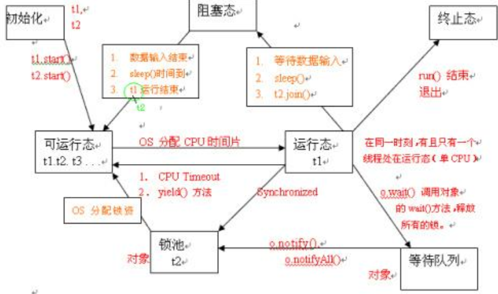

<h1>进程和线程的区别</h1>
进程是系统资源分配的基本单位,线程是CPU调度和分派的基本单位，线程属于某个进程，共享其资源。
*所有与进程有关的资源被记录在PCB中；<p>
*线程只由堆栈寄存器和，程序计数器和TCB组成。<p>
<font color="red">区别</font><p>
*线程不能看作独立应用，而进程可看做独立资源。<p>
*进程有独立的地址空间，相互不影响，线程只是进程的不同执行路径。<p>
*线程没有独立空间，多进程程序比多线程程序健壮。<p>
*进程切换比线程的切换开销大。<p>
<font color="red">java进程和线程关系 </font>

*运行一个程序会产生一个进程，进程包含至少一个线程<p>
*每个进程对应一个JVM实例，多个线程共享JVM堆<p>
*java采用单线程编程模型，程序会自动创建主线程<p>

#Thread的run()和start()的区别
start方法会创建一个子线程并启动，去执行run方法。<p>
run()方法只是thread的一个普通方法，调用它仍然在子线程进行。<p>

#Thread类和Runnabel的关系
Thread实现了Runnable接口。接口Runnable只有一个run方法。
*Runnable创建线程
```
public class RunableTest implements  Runnable {
    //step1：实现runable接口
    @Override
    public void run() {
        System.out.println("线程执行体");
    }

    public static void main(String[] args) {
        //创建runable接口实现类对象
        RunableTest runableTest = new RunableTest();
        //创建Thread对象，传入runable接口实现类对象
        Thread thread = new Thread(runableTest);
        //启动线程
        thread.start();
        System.out.println("线程正在启动");
        for (int i = 0; i < 100; i++) {
            System.out.println("主线程执行体");
        }
    }
}
```
关系：
*Thread类实现了Runnable接口的类，使得run方法支持多线程。
*因为类的单一继承原则，推荐使用Runnable接口创建线程。
#如何给run()方法传参
#如何处理线程的返回值
1主线程等待法（slee等待子线程完成）。<p>
2使用主线程的join()方法以等待子线程完毕。 <p>
3.通过Callable接口实现：FutureTask Or 线程池去获取。<p>
```
import java.util.concurrent.Callable;
import java.util.concurrent.ExecutionException;
import java.util.concurrent.FutureTask;
 
/*
 * 一、创建执行线程的方式三：实现 Callable 接口。 相较于实现 Runnable 接口的方式，方法可以有返回值，并且可以抛出异常。
 *
 * 二、执行 Callable 方式，需要 FutureTask 实现类的支持，用于接收运算结果。  FutureTask 是  Future 接口的实现类
 */
public class TestCallable {
 
    public static void main(String[] args) {
        ThreadDemo td = new ThreadDemo();
 
        //1.执行 Callable 方式，需要 FutureTask 实现类的支持，用于接收运算结果。
        FutureTask<Integer> result = new FutureTask<>(td);
 
        new Thread(result).start();
 
        //2.接收线程运算后的结果
        try {
            Integer sum = result.get();  //FutureTask 可用于 闭锁 类似于CountDownLatch的作用，在所有的线程没有执行完成之后这里是不会执行的
            System.out.println(sum);
            System.out.println("------------------------------------");
        } catch (InterruptedException | ExecutionException e) {
            e.printStackTrace();
        }
    }
 
}
 
class ThreadDemo implements Callable<Integer> {
 
    @Override
    public Integer call() throws Exception {
        int sum = 0;
 
        for (int i = 0; i <= 100000; i++) {
            sum += i;
        }
 
        return sum;
    }
 
}
```
*通过线程池返回结果
```
public class Main {
    public static void main(String[] args) throws InterruptedException, ExecutionException {
        ExecutorService executor = Executors.newFixedThreadPool(2);
        //创建一个Callable1，5秒后返回String类型
        Callable myCallable = new Callable() {
			    @Override
			    public String call() throws Exception {
			        Thread.sleep(5000);
			        System.out.println("calld方法执行了");
			        return "call方法返回值";
			    }
			};
		////创建一个Callable2，5秒后返回String类型
		Callable myCallable2 = new Callable() {
		    @Override
		    public String call() throws Exception {
		        Thread.sleep(3000);
		        System.out.println("calld2方法执行了");
		        return "call2方法返回值";
		    }
		};
        System.out.println("提交任务之前 "+getStringDate());
        Future future = executor.submit(myCallable);
        Future future2 = executor.submit(myCallable2);
        System.out.println("提交任务之后 "+getStringDate());
        System.out.println("开始获取第一个返回值 "+getStringDate());
        System.out.println("获取返回值: "+future.get());
        System.out.println("获取第一个返回值结束，开始获取第二个返回值 "+getStringDate());
        System.out.println("获取返回值2: "+future2.get());
        System.out.println("获取第二个返回值结束 "+getStringDate());
			}
    public static String getStringDate() {
        Date currentTime = new Date();
        SimpleDateFormat formatter = new SimpleDateFormat("HH:mm:ss");
        String dateString = formatter.format(currentTime);
        return dateString;
    }
}

```
输出：
```
提交任务之前 14:14:47
提交任务之后 14:14:48
开始获取第一个返回值 14:14:48
calld2方法执行了
calld方法执行了
获取返回值: call方法返回值
获取第一个返回值结束，开始获取第二个返回值 14:14:53
获取返回值2: call2方法返回值
获取第二个返回值结束 14:14:53
```
#线程的状态
6个状态

#Thread.sleep()和Object.wait()的区别
Thread.sleep()会让出CPU,但不会释放锁。
Object.wait()不仅会让出CPU,而且还会释放占用同步资源的锁。
#notify()和notifyAll()区别
两个概念：锁池，等待池。
锁池：假设线程A已经拥有对象锁，线程B、C想要获取锁就会被阻塞，进入一个地方去等待锁的等待，这个地方就是该对象的锁池；<p>
等待池：假设线程A调用某个对象的wait方法，线程A就会释放该对象锁，同时线程A进入该对象的等待池中，进入等待池中的线程不会去竞争该对象的锁。<p>
*1、notify只会随机选取一个处于等待池中的线程进入锁池去竞争获取锁的机会；<p>

*2、notifyAll会让所有处于等待池的线程全部进入锁池去竞争获取锁的机会；<p>
##yield的函数
yield当调用Thread.yield()函数的时候，回给线程调度器一个当前线程愿意让出CPU的使用的暗示，但是线程调度器可能会忽略这个暗示。对锁的行为无影响。
##如何中断线程
已被抛弃的方法通过调用Stop方法。<p>
调用Interrupt()方法。通知线程 该中断了。
1如果线程处于阻塞状态，那么线程将立即退出阻塞状态，并抛出一个InterruptedException异常。
2如果线程处于正常活动，那么会将该线程的中断标志位设为True.线程将继续正常运行，不受影响。因此需要调用线程配合中断。(1)在正常运行任务时，经常检查本线程的中断标志位，如果被设置了中断标志位就自行停止线程。


##线程间状态转换图
